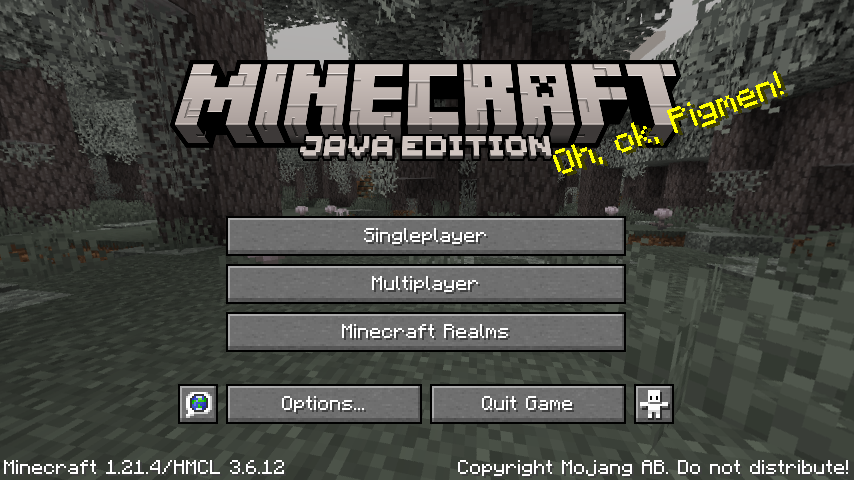

# MobileGL trace replay

This directory builds a Linux command line replay runner for [apitrace](https://github.com/apitrace/apitrace) files. It
is an integration testing infrastructure of MobileGL.

The bundled fixtures cover:

- OpenRA: sourced from GL4ES' apitrace corpus.
  
- minecraft-1.21.4-startup: captured from Minecraft 1.21.4's startup screen.
  
- minecraft-1.21.4-main-menu: captured from Minecraft 1.21.4's main menu.
  
- minecraft-1.17-main-menu-854: captured from Minecraft 1.17's 854x480 main menu through FCL MobileGL capture.
  
- minecraft-1.21.4-in-world: captured from Minecraft 1.21.4 after entering a singleplayer world.
  
- minecraft-1.21.4-fabric-sodium-in-world: captured from Minecraft 1.21.4 Fabric with Sodium after entering a
  singleplayer world with Fancy graphics.
  
- minecraft-26.2-main-menu: captured from Minecraft 26.2's main menu.
  
- minecraft-26.2-in-world: captured from Minecraft 26.2 after entering a normal singleplayer world.
  
- improved-transparency-minecraft-26.3: captured from the Minecraft 26.3 improved-transparency scene.
  
- minecraft-1.21.4-fabric-common-mods-in-world: captured from Minecraft 1.21.4 Fabric with Sodium, Iris, REI,
  Xaero's Minimap, Xaero's World Map, JourneyMap, and Modern UI, with shader packs disabled.
  
- minecraft-1.21.4-fabric-common-mods-inventory: captured from Minecraft 1.21.4 Fabric with Sodium, Iris, REI,
  Xaero's Minimap, Xaero's World Map, JourneyMap, and Modern UI with the creative inventory and REI item list open.
  
- minecraft-1.21.4-fabric-rei-inventory: captured from Minecraft 1.21.4 Fabric with Sodium, Iris, and REI, with
  shader packs disabled and the creative inventory and REI item list open.
  
- minecraft-1.21.4-fabric-xaero-minimap-in-world: captured from Minecraft 1.21.4 Fabric with Sodium, Iris, and
  Xaero's Minimap after entering a singleplayer world with shader packs disabled.
  
- minecraft-1.21.4-fabric-xaero-world-map-in-world: captured from Minecraft 1.21.4 Fabric with Sodium, Iris, and
  Xaero's World Map, with shader packs disabled and the world map screen open.
  
- minecraft-1.21.4-fabric-journeymap-in-world: captured from Minecraft 1.21.4 Fabric with Sodium, Iris, and
  JourneyMap after entering a singleplayer world with shader packs disabled.
  
- minecraft-1.21.4-fabric-modernui-inventory: captured from Minecraft 1.21.4 Fabric with Sodium, Iris, and Modern UI,
  with shader packs disabled and the creative inventory open.
  
- minecraft-1.21.4-fabric-rei-inventory-normal-world: captured from Minecraft 1.21.4 Fabric with Sodium, Iris, and
  REI in a normal singleplayer world, with shader packs disabled and the creative inventory and REI item list open.
  
- minecraft-1.21.4-fabric-xaero-minimap-in-world-normal-world: captured from Minecraft 1.21.4 Fabric with Sodium,
  Iris, and Xaero's Minimap after entering a normal singleplayer world with shader packs disabled.
  
- minecraft-1.21.4-fabric-xaero-world-map-in-world-normal-world: captured from Minecraft 1.21.4 Fabric with Sodium,
  Iris, and Xaero's World Map in a normal singleplayer world, with shader packs disabled and the world map screen open.
  
- minecraft-1.21.4-fabric-journeymap-in-world-normal-world: captured from Minecraft 1.21.4 Fabric with Sodium, Iris,
  and JourneyMap after entering a normal singleplayer world with shader packs disabled.
  
- minecraft-1.21.4-fabric-modernui-inventory-normal-world: captured from Minecraft 1.21.4 Fabric with Sodium, Iris,
  and Modern UI in a normal singleplayer world, with shader packs disabled and the creative inventory open.
  
- minecraft-1.21.4-fabric-iris-bsl-in-world: captured from Minecraft 1.21.4 Fabric with Sodium, Iris, and BSL
  Shaders after entering a singleplayer world.
  
- minecraft-1.21.4-fabric-iris-bsl-esc-menu-854: captured on an Android device (Mali-G77, FCL MobileGL capture) from
  Minecraft 1.21.4 Fabric with Sodium, Iris, and BSL Shaders, at the pause menu over a BSL-blurred world. The frame
  pins glyph rendering: every menu label, the menu title and the tutorial toast must be present. Regressions in the
  DirectGLES per-draw texture memo have made the whole text path disappear here while sprites kept rendering, so a
  failure that leaves the buttons but empties them is the signature to look for in the diff.
  
- minecraft-1.21.4-fabric-iris-makeup-ultrafast-in-world: captured from Minecraft 1.21.4 Fabric with Sodium, Iris, and
  MakeUP UltraFast after entering a singleplayer world.
  
- minecraft-1.21.4-fabric-iris-super-duper-vanilla-in-world: captured from Minecraft 1.21.4 Fabric with Sodium, Iris,
  and Super Duper Vanilla after entering a singleplayer world.
  
- minecraft-1.21.4-fabric-iris-complementary-reimagined-in-world: captured from Minecraft 1.21.4 Fabric with Sodium,
  Iris, and Complementary Reimagined after entering a singleplayer world.
  
- minecraft-1.21.4-fabric-iris-complementary-unbound-in-world: captured from Minecraft 1.21.4 Fabric with Sodium,
  Iris, and Complementary Unbound after entering a singleplayer world.
  
- minecraft-1.21.4-fabric-iris-mellow-in-world: captured from Minecraft 1.21.4 Fabric with Sodium, Iris, and Mellow
  after entering a singleplayer world.
  
- minecraft-1.21.4-fabric-iris-nostalgia-in-world: captured from Minecraft 1.21.4 Fabric with Sodium, Iris, and
  Nostalgia after entering a singleplayer world.
  
- minecraft-1.21.4-fabric-iris-bliss-in-world: captured from Minecraft 1.21.4 Fabric with Sodium, Iris, and Bliss
  after entering a singleplayer world.
  
- minecraft-1.21.4-fabric-iris-chocapic-v6-lite-in-world: captured from Minecraft 1.21.4 Fabric with Sodium, Iris, and
  Chocapic V6 Lite after entering a singleplayer world.
  
- minecraft-1.21.4-fabric-iris-iterationt-in-world: captured from Minecraft 1.21.4 Fabric with Sodium, Iris, and
  iterationT after entering a singleplayer world.
  
- minecraft-1.21.4-fabric-iris-iterationt-nodsa-in-world: captured from Minecraft 1.21.4 Fabric with Sodium, Iris, and
  iterationT after entering a singleplayer world, with Iris' DSA path disabled.
  
- minecraft-1.21.4-fabric-iris-iterationrp-in-world: captured from Minecraft 1.21.4 Fabric with Sodium, Iris, and
  iterationRP after entering a singleplayer world, framing the iterationRP name overlay over a lake with far-shore
  tree reflections. iterationRP's temporal auto-exposure makes a single-frame trim overexpose and drop the overlay,
  so the fixture is a prefix trace (all calls up to the target frame) that replays the temporal state. The pack also
  gates an NVIDIA-only shadow path (`subgroupPartitionNV`, `GL_NV_shader_subgroup_partitioned`) on the GL vendor
  string, so the capture reports a masked vendor and the trace carries the portable `subgroupShuffleXor` path that
  non-NVIDIA GPUs take.
  The trace archive and golden are not committed yet (the repository's Git LFS quota rejects new objects with
  `GH009`); the case stays registered and its fixture files are hydrated from the trace fixture mirror.
- minecraft-1.21.4-fabric-iris-photon-v1.1-in-world: captured from Minecraft 1.21.4 Fabric with Sodium, Iris, and
  Photon v1.1 after entering a singleplayer world.
  
- minecraft-1.21.4-fabric-iris-photon-v1.3b-in-world: captured from Minecraft 1.21.4 Fabric with Sodium, Iris, and
  Photon v1.3b after entering a singleplayer world.
  
- minecraft-1.21.4-fabric-iris-derivative-main-d24.4.14-in-world: captured from Minecraft 1.21.4 Fabric with Sodium,
  Iris, and Derivative Main d24.4.14 after entering a singleplayer world.
  
- minecraft-1.21.4-fabric-iris-sundial-lite-in-world: captured from Minecraft 1.21.4 Fabric with Sodium, Iris, and
  Sundial Lite after entering a singleplayer world.
  
- minecraft-1.21.1-neoforge-create-indirect-in-world: captured from Minecraft 1.21.1 NeoForge with Create, Sodium,
  and Iris (no shader pack) in a world facing Create water wheels and a large cogwheel, with Flywheel's
  `flywheel:indirect` backend (compute-shader culling, glMultiDrawElementsIndirect, persistent-mapped staging).
  
- minecraft-1.21.1-neoforge-create-instancing-in-world: same world and camera as the indirect case, with Flywheel's
  `flywheel:instancing` backend (texture-buffer instance data, glDrawElementsInstancedBaseVertex).
  

Build from the MobileGL repository root:

```sh
cmake -S . -B build-test -G Ninja \
  -DMOBILEGL_BUILD_TEST=ON \
  -DMOBILEGL_BUILD_BENCHMARK=OFF \
  -DMOBILEGL_BUILD_TRACE_REPLAY=ON
cmake --build build-test
```

Run the fixture tests:

```sh
ctest --test-dir build-test -V -R 'MobileGLTraceReplay\.'
```

Run the CLI directly:

```sh
build-test/tools/trace_replay/mobilegl_trace_replay \
  --trace openra.trace \
  --golden openra.0000031249.png \
  --output out/openra \
  --backend DirectGLES \
  --mobilegl-library build-test/libMobileGL.so \
  --target-call 31249 \
  --width 640 \
  --height 480 \
  --crop-x 1 \
  --crop-y 1 \
  --crop-width 638 \
  --crop-height 478 \
  --ssim-threshold 0.99
```

## Dumping framebuffer attachments mid-frame

`--target-call` snapshots one framebuffer. To see *inside* a frame - which
intermediate render target a pass actually produced - pass
`--dump-fbo-attachments CALL:DIR[:FBO,FBO,...]`, repeatably:

```sh
build-test/tools/trace_replay/mobilegl_trace_replay \
  --trace trace.trace --golden golden.png --output out --target-call 2667619 \
  --dump-fbo-attachments 2666231:out/fbos-before \
  --dump-fbo-attachments 2666232:out/fbos-after
```

At each call boundary it walks every live framebuffer object (or only the named
ones), reads back every colour attachment and the depth attachment, and writes
`fbo<N>-att<M>.png` / `fbo<N>-depth.png` plus a `manifest.txt` line per
attachment recording the attached object, size, internal format, component type
and per-channel min/max/mean and a content hash. Attachments are read as floats
whatever their storage, so HDR accumulation buffers stay legible in the
statistics even though the PNG has to clamp.

The manifest is the useful part when comparing two drivers: dump the same call
on both stacks and `diff`/`paste` the two manifests, and the first attachment
whose hash differs names the pass that diverged. Read-side and pixel-pack state
is saved and restored, so the replay continues unperturbed; without the flag
nothing is installed and the replay is byte-for-byte what it was.

Run the macOS native-window DirectVulkan retrace matrix and render the same
HTML overview shape as CI:

```sh
cmake -S . -B cmake-build-macos-trace-arm64 -G Ninja \
  -DCMAKE_BUILD_TYPE=Release \
  -DCMAKE_OSX_ARCHITECTURES=arm64 \
  -DMOBILEGL_BUILD_TEST=OFF \
  -DMOBILEGL_BUILD_BENCHMARK=OFF \
  -DMOBILEGL_BUILD_TRACE_REPLAY=ON
cmake --build cmake-build-macos-trace-arm64 --target MobileGL mobilegl_trace_replay
python3 tools/trace_replay/run_macos_window_retrace_local.py --ci --all
open .trace-work/macos-window-retrace-summary/mobilegl-macos-window-vulkan-retrace-overview.html
```

The macOS runner hydrates missing fixtures from the trace fixture mirror with
parallel downloads before falling back to Git LFS. It reuses the
`cmake-build-macos-trace-arm64` harness by default on Apple Silicon, passes
`--window-surface`, and defaults to DirectVulkan only. If a native-window replay
hits a fatal assertion, the runner writes a failure result and stops before
launching later cases; use `--continue-after-fatal` to collect the full matrix,
or `--skip-case NAME` for known fatal cases.

## Android device replay

Build and install the generic trace APK from the repository root. Both
`DirectGLES` and `DirectVulkan` use the same APK and package; select the
backend with the intent's `backend` extra.

```sh
gradle --no-daemon -p android-plugin :app:assembleTraceDebug
TRACE_APK=$(find android-plugin/app/build/outputs/apk/trace/debug -maxdepth 1 -name '*.apk' -print -quit)
adb install -r "$TRACE_APK"
```

Prepare a fixture and copy it into the app-private directory:

```sh
mkdir -p /tmp/mobilegl-openra
tar -xzf tools/trace_replay/fixtures/openra.tgz -C /tmp/mobilegl-openra
adb push /tmp/mobilegl-openra/openra.trace /data/local/tmp/mobilegl-openra.trace
adb push tools/trace_replay/fixtures/openra.0000031249.png /data/local/tmp/mobilegl-openra.golden.png

PKG=top.mobilegl.plugin.trace
APP_DIR=/data/user/0/$PKG/files/trace-replay
adb shell run-as $PKG rm -rf files/trace-replay
adb shell run-as $PKG mkdir -p files/trace-replay/input files/trace-replay/output
adb shell run-as $PKG cp /data/local/tmp/mobilegl-openra.trace files/trace-replay/input/openra.trace
adb shell run-as $PKG cp /data/local/tmp/mobilegl-openra.golden.png files/trace-replay/input/openra.golden.png
```

Launch the standalone trace runner Activity:

```sh
adb shell am force-stop $PKG
adb shell am start -W -a top.mobilegl.plugin.TRACE_REPLAY \
  -n $PKG/top.mobilegl.plugin.trace.TraceReplayActivity \
  --es trace_path $APP_DIR/input/openra.trace \
  --es golden_path $APP_DIR/input/openra.golden.png \
  --es output_dir $APP_DIR/output \
  --es diff_path $APP_DIR/output/openra-diff.png \
  --es backend DirectGLES \
  --el target_call 31249 \
  --ei width 640 \
  --ei height 480 \
  --ei crop_x 1 \
  --ei crop_y 1 \
  --ei crop_width 638 \
  --ei crop_height 478 \
  --es ssim_threshold 0.99
```

Read back the result and images:

```sh
adb shell run-as $PKG cat files/trace-replay/output/result.json
adb exec-out run-as $PKG cat files/trace-replay/output/actual.png > openra-actual.png
adb exec-out run-as $PKG cat files/trace-replay/output/openra-diff.png > openra-diff.png
```

For Vulkan replay, keep the same APK and `$PKG`, then pass
`--es backend DirectVulkan`. DirectGLES also renders to the Activity surface by
default; pass `--ez use_pbuffer true` to use the offscreen pbuffer path. Always
`adb shell am force-stop $PKG` before another replay: apitrace snapshot state is
process-local. For cases registered with `coherent_as_flush` (Flywheel-style
unflushed persistent maps, e.g. the Create fixtures), pass
`--ez coherent_as_flush true` so the replay runs with
`MOBILEGL_COHERENT_AS_FLUSH=1`.

## Reproducing the Android DirectGLES lane on Linux (ANGLE on lavapipe)

The APK workflow's DirectGLES lane is not the same stack as the Linux one, which
is why a case can be green here and red there:

| lane | stack |
| --- | --- |
| Linux `Test` retrace, DirectGLES | Espryt -> Mesa GLES -> llvmpipe |
| Android `APK` retrace, DirectGLES | Espryt -> **ANGLE** -> Mesa Vulkan (lavapipe) |
| Android `APK` retrace, DirectVulkan | Magma -> lavapipe (no ANGLE) |

Only the Android DirectGLES lane puts ANGLE in the middle, so an ANGLE
translation difference shows up in exactly one of the six combinations. That
stack can be reproduced on Linux without an emulator, which is far faster to
iterate on than a CI round trip. The Android emulator SDK ships a glibc ANGLE:

```sh
ANGLE=$ANDROID_SDK_ROOT/emulator/lib64/gles_angle
mkdir -p ~/angle-farm && cd ~/angle-farm
# MobileGL dlopens these two names; ANGLE's own libEGL then dlopens the
# unsuffixed libGLESv2.so from the same directory - without that symlink it
# loads a truncated entry-point table and dies on a missing EGL function.
ln -sf $ANGLE/libEGL.so    libEGL_angle.so
ln -sf $ANGLE/libGLESv2.so libGLESv2_angle.so
ln -sf $ANGLE/libEGL.so    libEGL.so
ln -sf $ANGLE/libGLESv2.so libGLESv2.so
ln -sf $ANGLE/libvulkan.so.1 libvulkan.so.1   # else eglInitialize fails

MOBILEGL_USE_ANGLE=1 \
LD_LIBRARY_PATH=~/angle-farm:/path/to/build/ \
VK_ICD_FILENAMES=/usr/share/vulkan/icd.d/lvp_icd.json \
ANGLE_DEFAULT_PLATFORM=vulkan \
  ./mobilegl_trace_replay --trace trace.trace --golden golden.png \
    --target-call N --width 854 --height 480 --backend DirectGLES \
    --output outdir --pbuffer-surface
```

`ANGLE_DEFAULT_PLATFORM=vulkan` is required: ANGLE otherwise picks its OpenGL
backend and you get `ANGLE (Mesa, llvmpipe ..., OpenGL 4.6 (Core Profile))`
instead of the CI-shaped `ANGLE (Mesa, Vulkan 1.x (llvmpipe ...))`. Check
`MOBILEGL_TRACE_GL_RENDERER` in `outdir/retrace.log` before trusting a result.
Run the binary directly rather than through `ctest`, whose `ENVIRONMENT`
property overrides these variables. Build with clang, not gcc: gcc rejects
`GLXImpl.cpp` under `-Wchanges-meaning`.

### improved-transparency-minecraft-26.3 on the ANGLE lane

This case has never passed on the Android DirectGLES lane. It renders correctly
everywhere else, including Android DirectVulkan on the same emulator. The
rendered frame loses the whole translucent layer - clouds and water are absent
while opaque geometry is pixel-exact - so the compositing chain never receives
the translucent content rather than blending it wrongly.

**It is two defects in the ESSL we generate, and both are ours.** Replaying the
fixture through the recipe above and through Mesa GLES, with a
`MOBILEGL_LOG_LEVEL_DEBUG` build, gives SSIM 1.000000 on Mesa and 0.970127 on
ANGLE while the *frontend* call stream is byte-identical - 2698222 calls, same
names, same order, same arguments, the only difference being how often the app
polls `glClientWaitSync`. That comparison is what misled the earlier
investigation: it is the app-to-MobileGL direction. It says nothing about the
GLES and ESSL MobileGL emits *downwards*, which is where the two lanes part.

Two shaders that MobileGL generates fail to compile on ANGLE and link no
program at all, so every draw that uses them is a silent no-op:

| # | ANGLE compile error | what it is | what disappears |
| --- | --- | --- | --- |
| A | `0:2: 'GL_EXT_texture_buffer' : extension is not supported` then `'isamplerBuffer' : Illegal use of reserved word` | the cloud vertex shader emits `#extension GL_EXT_texture_buffer : require` and `uniform highp isamplerBuffer CloudFaces` unconditionally | clouds |
| B | `'[' : array indexes for fragment outputs must be constant integral expressions` | the OIT coefficient fragment shader declares `layout(location = 0) out highp vec4 coeff[2];` and writes `coeff[attachmentIndex][i]` from a loop | the whole translucent accumulation |

Neither is an ANGLE mistranslation:

- **A is a capability gap we do not guard.** Minecraft 26.3 builds clouds
  entirely from `gl_VertexID` plus `texelFetch` on a buffer texture
  (`glTexBuffer(GL_TEXTURE_BUFFER, GL_R8I, ...)`). Mesa GLES advertises
  `GL_EXT_texture_buffer` and `GL_OES_texture_buffer`; the ANGLE in the local
  farm advertises neither (142 extensions against Mesa's 162), and MobileGL's
  reported `GL_MAX_TEXTURE_BUFFER_SIZE` drops to the 65536 default because it
  cannot query one. We emit the `require` line anyway.
- **B is a GLSL ES rule we violate.** Fragment output arrays must be indexed
  with constant integral expressions; SPIRV-Cross hands us a loop-variable
  index and Mesa's compiler accepts it, ANGLE does not. Any strict ES driver
  rejects this shader, so it is not ANGLE-specific in principle - it is
  Mesa's leniency that hides it on the Linux lane.

##### The local ANGLE is not the CI ANGLE - check before attributing

This trap cost a full round of analysis, so check it first. The Linux farm
recipe above uses the emulator SDK's ANGLE; the Android lane uses a *pinned*
build downloaded by `apk.yml` (`MOBILEGL_TRACE_ANGLE_VARIANT`, default
`ec889e6ea831`). They are far apart:

| | local farm ANGLE | CI lane ANGLE |
| --- | --- | --- |
| `GL_RENDERER` | `ANGLE (Mesa, Vulkan 1.4.354 (llvmpipe ...), llvmpipe-26.1.4)` | `ANGLE (Mesa, Vulkan 1.3.0 (llvmpipe ...), Mesa-25.2.4)` |
| extensions | 142 | 184 |
| `GL_EXT_texture_buffer` / `GL_OES_texture_buffer` | absent | **present**, `GL_MAX_TEXTURE_BUFFER_SIZE 134217728` |
| ES 3.2 core base vertex | no | yes |

So **defect A cannot be what fails on CI** - it is an artefact of the older
local ANGLE. The CI frame nevertheless loses clouds *and* water with the same
signature (`ssim=0.968845` against the local farm's 0.970127, opaque geometry
exact), and defect B is the remaining named cause: the coefficient writer is in
the OIT phase shader that *both* the cloud and the translucent-terrain
programs link against, so one rejected shader empties both layers.

That last step is **not yet directly confirmed on CI**, because the retrace APK
is built `-Pmobilegl.logLevel=MOBILEGL_LOG_LEVEL_INFO`, where `MGLOG_E` is
compiled out - the CI `mobilegl.log` carries 294 INFO lines and zero ERROR
lines, so the shader-compile diagnostics never reach the artifact. Confirming it
means replaying on an emulator with a debug-level trace APK and the pinned ANGLE
variant (`tools/trace_replay/run_android_retrace_local.py`), or promoting
shader-compile failures to a log level that survives an INFO build.

There is therefore **no honest harness accommodation**: no
`--avoid-angle-llvmpipe-*` flag can conjure a missing extension or make an
illegal shader legal, so the fixture stays red on the Android DirectGLES lane.
Fixing it means fixing the emitters - rewriting non-constant fragment-output
indexing into a switch over constant indices, and guarding the buffer-texture
`require` on driver support - which is shared backend work, not harness work.

Two earlier candidates remain correctly ruled out and should not be re-walked:
per-attachment blend equations are both recorded and applied correctly on ANGLE
(`glBlendEquationSeparatei` with GL_MAX on one attachment reads back as GL_MAX
and rasterizes as GL_MAX), and the GLES draw-buffer slot restriction is already
handled by `BackendFramebufferObject::RecomputeBackendColorSlots`.

#### Where in the frame it goes wrong

Snapshotting the same intra-frame call points on both stacks (`--target-call`,
ten replays in parallel, logs to `/dev/null`) localises it. SSIM against the
golden at each point:

| target call | what runs there | Mesa | ANGLE | gap |
| --- | --- | --- | --- | --- |
| 2667445 | last opaque draw, into FBO 29 | 0.146477 | 0.000195 | - |
| 2667488 | **OIT composite**: fullscreen triangle, program 50, into FBO 3 | 0.976448 | 0.945409 | 0.031 |
| 2667543 | post draw, program 56 | 0.985380 | 0.954480 | 0.031 |
| 2667595 | post draw, program 64 | 0.985685 | 0.954788 | 0.031 |
| 2667619 | golden point | 1.000000 | 0.970127 | 0.030 |

The gap opens at the composite and is then constant to four decimal places -
every pass after 2667488 contributes the same increment on both drivers. So
nothing downstream of the composite is implicated, and the GUI/post chain is
fine. The two stacks already disagree at 2667445, before the composite runs,
which points at the translucent accumulation targets the composite samples
rather than at the composite draw itself.

#### Which attachment, and which draw

`--dump-fbo-attachments` on both stacks pins it to a single draw. These numbers
are from the local farm, so the first divergence they show is defect A's cloud
draw; on CI, where clouds compile, the chain instead breaks one pass later at
the coefficient accumulation. Comparing the manifests at three call boundaries,
over all 30 live framebuffers:

| call | what has just run | verdict |
| --- | --- | --- |
| 2665649 | depth blit, before the translucent chain | every OIT target identical on both stacks |
| 2666231 | all entity/particle translucent draws done | still identical: FBO 21 att0 (texture 1554, RGBA32F) reads `c1 max=178.98 mean=1.81046` on Mesa against `179 / 1.8105` on ANGLE |
| 2666232 | the cloud draw - `glDrawElementsInstancedBaseVertex(count=221706)` with `GL_TEXTURE_BUFFER` bound | Mesa moves to `c1 max=1727.87 mean=70.2899`; **ANGLE does not move at all** |

At the golden point the same holds for the rest of the chain: texture 1555 (the
translucent colour accumulation) has mean 0.105617 on Mesa against 0.00403189 on
ANGLE, and texture 1556 (the alpha/coefficient target, FBO 26 attachment 1) is
alpha `max=1.34863 mean=0.261387` on Mesa and **identically zero** on ANGLE -
never written, because defect B linked no program for that pass. Everything
outside the translucent chain matches: the opaque terrain, the block atlas and
its mips, and the GUI targets differ only in the last float ULP.

So the earlier reading of the SSIM bisect was right about the location and wrong
about the cause. The composite at 2667488 is innocent; it faithfully composites
accumulation buffers that two failed shader compiles left empty.

Reproduce with:

```sh
for stack in mesa angle; do ... --target-call 2666232 \
  --dump-fbo-attachments 2666232:out-$stack/fbos ; done
paste out-mesa/fbos/manifest.txt out-angle/fbos/manifest.txt
```

and read the compile errors straight out of `mobilegl.log`:

```sh
grep -aE 'Shader compilation failed|linking failed' out-angle/mobilegl.log
```

### minecraft-1.21.4-fabric-iris-sundial-lite-in-world on the ANGLE lane

This case takes the **emulator process down**, every run, on its first attempt.
It is not a timeout (it dies ~74s into a 900s budget) and it is not host memory
pressure. From the retained diagnostics of run 31552175083:

- `host-dmesg.txt` contains no OOM, no `oom-kill`, no `Killed process`.
- `host-memory.txt` reports 11Gi of 15Gi available and 44Ki of 8Gi swap used.
- `host-dmesg.txt` contains exactly two faults, both at the same moment and the
  same instruction:

  ```
  llvmpipe-1[3216]: segfault at 8 ip 00007f99296b276e error 4
  llvmpipe-0[3215]: segfault at 8 ip 00007f99296b276e error 4
  ```

Those are host Mesa **llvmpipe** rasterizer worker threads - the emulator's own
renderer, not SwiftShader - and their death takes the emulator with them
(`kvm [2665]` before the fault, `kvm [3554]` after the restart, matching
`pid_2665.ini` in `emulator-first-attempt.log`). The faulting instruction
decodes as `mov 0x13c0(%rsp,%rax,8),%rax` followed by `cmpl $0x0,0x8(%rax)`:
an **indexed load out of a stack pointer-table** that returned null, then a
dereference of it. That is the shape an out-of-range array index produces in a
JIT rasterizer.

Do not raise the swap allocation to match `test.yml` - the OOM hypothesis is
dead, and doing so would only hide the question.

The retry leg is a separate, milder failure (`statusCode 5`, "failed to make
current OpenGL context and drawable" after a complete capability probe) and is
deliberately **not** covered by the surface-lost infrastructure clause: its
`retrace.log` carries neither the `0x300b` nor the `-1000000001` marker, and its
`mobilegl.log` does reach `OpenGL ES capabilities:`. Both guards exclude it, so
the run is charged as a failure rather than retried away.

#### Not the same root cause as improved-transparency, and it reproduces on the desktop

Checked directly: the generated ESSL for this fixture contains **no fragment
output arrays and no dynamic output indexing**. Across its 44 shader dumps there
are zero `out ... [N]` declarations, zero `gl_FragData` references, and zero
`mg_FragColor_` replicas - so `BroadcastLegacyFragColor` never even fires here.
Every output is a plainly named location, e.g.

```
layout(location = 0) out highp vec4 gbufferData0;
layout(location = 0) out float iris_FogFragCoord;
layout(location = 2) out vec3 skyColorUp;
```

So the improved-transparency defect (non-constant index into a fragment-output
array) is **not** what kills the emulator here, and the two need separate fixes.

The crash does reproduce locally through the ANGLE recipe above, which is much
cheaper than bisecting on an emulator. Running this fixture on both stacks:
Mesa passes at SSIM 0.996301; ANGLE exits **139** (SIGSEGV) with no result.json,
and the host kernel log shows the same fault as CI - several `llvmpipe-N`
worker threads, `segfault at 8`, `error 4`, all at one instruction. It dies
immediately after program 58 links, on a draw logged as
`Using raw depth fetch sampler on unit 13`. Debug that repro under gdb before
reaching for the 13-commit bisect.

#### What the crash actually is

Run the ANGLE invocation under `gdb -batch` with `handle SIGSEGV stop nopass`
(apitrace installs its own handler, so gdb has to stop first). The faulting
thread is `llvmpipe-0`, and:

```
rip 0x7fffea1f7a28   ->  "No symbol matches $rip", in no shared object
rax 0x0
=> cmpl   $0x0,0x8(%rax)      <-- fault: deref of NULL+8
   vmovdqa %ymm5,0xac0(%rsp)
   je     ...
   mov    (%rax),%rax
```

`rip` belongs to no library, so this is **llvmpipe's JIT-compiled fragment
shader**, not Mesa C code - which is why the backtrace is garbage (the "frames"
are SIMD shader constants: `0x3c800000` = 0.015625f, `0x42800000` = 64.0f,
`0xffc00000` = NaN). Do not chase that backtrace.

The CI kernel log records the instruction immediately before the fault:
`mov 0x13c0(%rsp,%rax,8),%rax`. So the shape is: **index a stack-resident
pointer table by a unit number, get NULL back, then null-check-and-follow it.**
That is a per-texture-unit descriptor lookup. A sampler in this shader resolves
to a texture unit for which the ANGLE/lavapipe side has no valid descriptor, and
llvmpipe's JIT dereferences it instead of returning the (0,0,0,1) that sampling
an incomplete texture is required to give - so the crash itself is a **driver
bug**, whatever state we hand it.

The draw is program 58 (fragment shader 60), a deferred reflection/solid
composite ending `texBuffer0 = reflectionData; texBuffer3 = solidColor;`, with
20+ samplers declared (`colortex0..7`, `depthtex0..2`, `shadowtex0/1`,
`shadowcolor0`, `noisetex`, `gtexture`, `normals`, `specular`, `gaux2`,
`transmittanceTex`) against `GL_MAX_TEXTURE_IMAGE_UNITS = 32`. The last state
operation logged before the fault is `Using raw depth fetch sampler on unit 13`
- `GetRawDepthFetchSampler()->Bind(unit)` in `DirectGLES.cpp`, which puts a
dedicated sampler object on the unit when a `sampler2D` uniform reads a
depth-format texture. Mesa GLES takes that same path 90 times in this trace
without crashing; ANGLE dies on the second one.

Still unproven: **which** sampler/unit holds the NULL descriptor. Unit 13 is the
prime suspect because it is the last thing logged, not because it has been
shown to be the NULL entry. Nothing in the debugger points at a specific
MobileGL emission commit, so the held 13-commit bisect does **not** collapse to
a one-commit confirmation on this evidence.

#### The sampler state is not the trigger

A temporary probe in the sampler-unit sync (archived, never landed) logged, for
every sampler uniform of every draw, the tuple `(uniform location, uniform type,
resolved unit, bound texture id, internal format, completeness)`. Run on both
stacks and diffed:

- **No unit is missing a texture and none is incomplete.** Across the entire
  ANGLE run there are zero `tex=NONE` and zero `complete=0` tuples. The
  "sampler uniform points at a unit with nothing bound" theory is dead.
- Unit 13 - the raw-depth-fetch unit, and the prime suspect from the previous
  leg - holds `tex=64`, a depth format, `complete=1`. It is exonerated as a
  dangling binding.
- **The crashing draw's state is identical on both stacks.** Its 14 tuples match
  the passing Mesa run exactly, and Mesa executes the very tuple
  `loc=35 type=GL_SAMPLER_2D unit=13 tex=64 complete=1` **45 times** without
  crashing. ANGLE dies the first time it reaches it.

So nothing in the sampler->unit->texture mapping distinguishes the crash. What
the diff did turn up is one genuine divergence, ~80 tuples upstream: ANGLE's
compiler reports an **extra live sampler uniform** that Mesa's does not, and it
aliases a unit already in use -

```
angle: loc=3  type=GL_SAMPLER_2D unit=0 tex=76   <- both stacks
angle: loc=14 type=GL_SAMPLER_2D unit=0 tex=76   <- ANGLE only
mesa : (no loc=14; stream continues one tuple ahead from here)
```

Two sampler uniforms resolving to the same unit is the subject of
`b6a2bf08 [Fix] (DirectGLES): resolve an aliased texture unit by the sampler's
type`, which sits **inside** the `8025745f..5a400e02` regression window - the
first concrete link between that window and this crash. It is a lead, not a
proven cause: it is upstream of the fault and the two runs still agree on the
crashing draw itself.

**Fix shape: avoidance, not correctness.** Nothing here shows MobileGL in the
wrong - our state at the faulting draw is exactly the state a passing driver
handles 45 times over. Sampling is required to be safe whatever the binding, so
the NULL-deref is the driver's bug. Any change on our side is therefore working
around a driver defect and should be scoped and named as such, ideally behind
the `--avoid-angle-llvmpipe-*` family rather than in shared backend paths. The
ingredient the probe did **not** capture, and the next thing to instrument, is
the *sampler object* bound to the unit: unit 13 takes a depth-format texture
through a plain `GL_SAMPLER_2D` with the raw-depth-fetch sampler override, while
unit 12 takes another depth texture as `GL_SAMPLER_2D_SHADOW` in the same draw.
